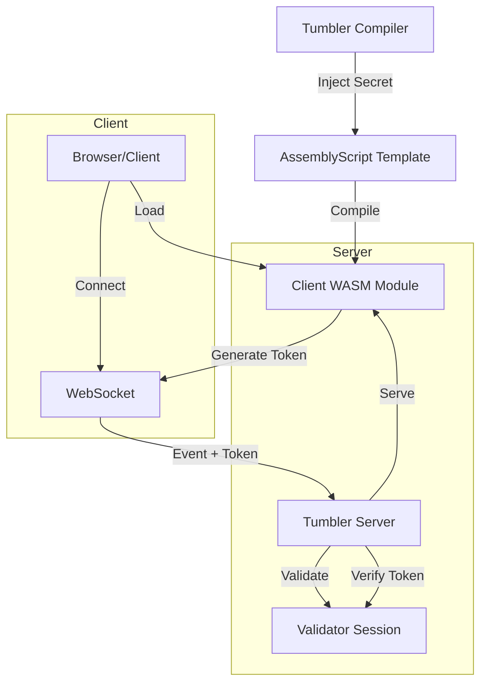

# Experimental Research: Tumbler - Zero Knowledge Secure Communications Framework

> **Status**: Active Research
> **Domain**: Cryptography, WebSockets, Systems Architecture
> **Stack**: TypeScript, AssemblyScript (WASM), Bun

## Abstract

This repository serves as an open research lab using **Tumbler**, a secure communication framework designed to facilitate verified, low-latency interactions between clients and servers. The primary subject of study is the integration of **Zero Knowledge (ZK) Proofs**, or other cryptographic devices within a high-performance WebSocket environment. The goal is to establish a protocol where client identity and session integrity can be continuously verified without exposing sensitive secrets, using compiled WebAssembly modules for client-side cryptographic operations.

Tumbler currently implements a polymorphic architecture where the "Runtime" logic is shared between the server and the client but compiled into different targets (Native JS/TS for Server, WASM for Client).

## Core Research Questions

1.  **Can we enforce session integrity client-side using opaque WASM modules?**
    *   *Hypothesis*: By compiling session secrets and logic into a WASM binary, we can raise the barrier to entry for reverse-engineering and tampering, creating a "trusted" client environment.
2.  **How efficient is a custom binary protocol for verified events?**
    *   *Hypothesis*: A minimal binary header containing a rolling ZK token, followed by a JSON payload, offers the best balance between security overhead and developer usability.
3.  **Is Xorshift128 sufficient for session tokens in a low-stakes verified environment?**
    *   *Question*: While not cryptographically secure for high-value secrets, is it sufficient for maintaining session state coherence/synchronization in a real-time app?

## Current System Architecture

The system uses a unique "Compiler" step that injects secrets into an AssemblyScript template before compiling it to WASM.

### Key Components

*   **Tumbler Compiler**: A build-tool that dynamically generates client artifacts. It takes a "Source of Truth" configuration and bakes secrets directly into the client executable.
*   **Validator (Server)**: A server-side host for the same WASM logic used by the client. It runs a mirror simulation of the client's PRNG state to verify every incoming packet.
*   **WASM Runtime (Client)**: A lightweight AssemblyScript module that handles the handshake and token generation. It exports a `generateToken()` function that the JS client uses to sign every request.
*   **Binary Event Bus**: A hybrid protocol.
    *   **Header (9 bytes)**: `Uint8` Event Type + `Uint64` Session Token.
    *   **Body**: UTF-8 Encoded JSON.

## Current Experiments

### 1. The Mirror Validation Strategy
We are testing a "Mirror" strategy where the server maintains a precise copy of the client's deterministic state.
*   **Mechanism**: Both client and server verify a `seed` during the handshake. The client steps its PRNG (Xorshift128) to generate a token for every message. The server steps its own local instance of the PRNG to verify the token matches.
*   **Goal**: To prevent "Replay Attacks" and "Packet Injection" by ensuring that every packet must be signed by the correct next number in the hidden sequence.

### 2. Polymorphic Event Handlers
The framework attempts to unify the definition of events.
*   **`TumblerEvent`**: A structure (likely shared) that allows defining handlers that can be triggered from either side, though the current implementation is heavier on the Server-Side listening.

## Problems and Limitations

1.  **PRNG Predictability**
    *   *Issue*: Xorshift128 is fast but not cryptographically secure. If an attacker recovers the internal state (4x `u64`), they can predict all future tokens.
    *   *Mitigation*: The state is hidden inside the WASM memory, requiring the attacker to inspect the WASM heap rather than just network traffic.
    *   *Planned Fix*: Migration to a stronger CSPRNG (ChaCha20 or similar) if performance allows.

2.  **WASM Interop Overhead**
    *   *Issue*: Crossing the JS <-> WASM boundary for every event token generation adds overhead.
    *   *Observation*: For high-frequency game loops (e.g., 60 ticks/sec), this might be negligible, but for massive batch processing, it could be a bottleneck.
    *   *Status*: Monitoring.

3.  **Hardcoded Secrets & Recompilation**
    *   *Issue*: Secrets are baked into the WASM at compile time. Changing a secret requires recompiling and redistributing the WASM blob.
    *   *Impact*: Key rotation is expensive and requires client refreshing.

## Roadmap & Speculations

*   **Diffie-Hellman Handshake**: Implementing a true key exchange within the WASM module so secrets don't need to be hardcoded, allowing for dynamic session encryption.
*   **Encrypted Payloads**: Moving beyond just *signing* packets to fully *encrypting* the JSON payload inside the WASM, making the traffic opaque to sniffers.
*   **Obfuscation Pipeline**: Integrating a post-processing step to obfuscate the WASM binary, making reverse-engineering the state machine significantly harder.

---
*Documentation created with the assitance of AI*
